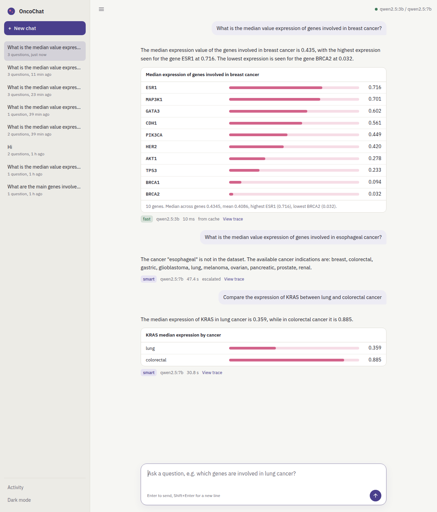

# OncoChat: ask a gene-expression dataset in plain language

[](https://github.com/m-bou/Oncochat/actions/workflows/ci.yml)

A proof of concept of an agentic assistant for non-technical stakeholders. You ask a question in English or
French. A local LLM picks and calls typed tools built on the two provided functions (`get_targets`,
`get_expressions`), deterministic guards check the answer against the data, and a Claude-like web UI streams
the result with tables.

Everything runs locally in Docker on a 16 GB laptop, with no GPU and no API key.



---

## 1. Run it

Every command exists in two equivalent runners:

| macOS / Linux / devcontainer | Windows (PowerShell) | What it does |
|---|---|---|
| `./run.sh up` | `.\run.ps1 up` | Creates `.env` if missing, then builds and starts the stack |
| `./run.sh down` / `logs` / `status` | `.\run.ps1 down` / `logs` / `status` | Stops the stack, follows logs, or shows containers and health |
| `./run.sh dev` | `.\run.ps1 dev` | API with auto-reload on :8000 (needs `uv`) |
| `./run.sh test [pytest args]` | `.\run.ps1 test [pytest args]` | 58 offline tests with a fake LLM, about 1 s |
| `./run.sh lint` / `fmt` | `.\run.ps1 lint` / `fmt` | ruff |
| `./run.sh eval [args]` | `.\run.ps1 eval [args]` | Live eval against Ollama. Without `uv`, it runs inside the app container |
| `./run.sh help` | `.\run.ps1 help` | All commands |

Both scripts are thin wrappers. Plain `docker compose up --build` works everywhere too.

On every push and pull request, GitHub Actions runs ruff and the offline test suite on Ubuntu and Windows
(`.github/workflows/ci.yml`). No model or Docker is needed, because the tests use a scripted fake LLM.

### Option A: Docker (recommended for reviewers)

Prerequisites: Docker Desktop (or Docker Engine with compose v2), about 10 GB of free disk, and 16 GB of RAM.

```bash
# macOS / Linux
git clone <this repo> && cd <repo>
./run.sh up
```

```powershell
# Windows (PowerShell)
git clone <this repo>; cd <repo>
.\run.ps1 up
```

Then open **http://localhost:8000**.

- **The first start downloads the models** (`qwen2.5:3b` at 1.9 GB and `qwen2.5:7b` at 4.7 GB) through the
  one-shot `ollama-init` service. The app starts once both are pulled. Later starts take seconds.
- At startup, the app **warms up** both models in the background (load and prompt-cache prefill, 1–2 min on
  CPU). The dot at the top right turns green when Ollama is reachable. `GET /api/health` shows the warm-up
  state.
- Settings live in `.env`. `up`, `init` and the devcontainer create it from `.env.example` when it is
  missing, and never overwrite an existing one. App settings (threads, thresholds, cache) take effect on the
  next app start. Compose-level ones (`FAST_MODEL`, `SMART_MODEL`, `OLLAMA_HOST`) need `up` again, or
  **Rebuild Container** in the devcontainer.

| Situation | Setting |
|---|---|
| 8 GB laptop | `SMART_MODEL=qwen2.5:3b` (one model serves both tiers) |
| **Mac**: much faster with the GPU | Install [Ollama](https://ollama.com) natively, run `ollama pull qwen2.5:3b && ollama pull qwen2.5:7b`, then set `OLLAMA_HOST=http://host.docker.internal:11434`. Docker on macOS cannot use Metal. |
| Windows 11 | See [Windows notes](#windows-notes) below (WSL memory, execution policy) |
| Hybrid Intel CPU (P+E cores) | `LLM_NUM_THREAD=8`. Ollama may use only the 2 P-cores; this roughly doubles speed. |

### Option B: VS Code devcontainer

Open the folder in VS Code, then run **Dev Containers: Reopen in Container**. This uses the same compose stack
(Ollama, the model pull, and the app with dev dependencies) and mounts the source at `/workspace`. The container
is Linux whatever your OS, so inside it use `./run.sh`:

```bash
./run.sh dev                  # uvicorn --reload on :8000 (port forwarded)
./run.sh test                 # 58 offline tests, fake LLM, about 1 s (args go to pytest)
./run.sh lint                 # ruff
./run.sh eval                 # live evaluation against Ollama (about 5 min on CPU)
./run.sh eval --tier fast     # args go to eval/run_eval.py
```

VS Code shortcuts are in `.vscode/`. They call `run.sh` on macOS, Linux and in the devcontainer, and `run.ps1`
when VS Code runs natively on Windows, so the same task works everywhere.

- **Run and Debug (F5)** (`launch.json`):
  - *API: debug*, plus a variant that skips the model warm-up for quick restarts;
  - *Tests: all / current file / live*;
  - *Eval: adaptive / forced tier / single case*.
- **Terminal → Run Task** (`tasks.json`):
  - *Stack: up* is the default build task (Ctrl+Shift+B), and *Test: offline suite* is the default test task;
  - *Stack: down / logs / status*;
  - *Dev: API with auto-reload*;
  - *Lint: ruff*, whose findings appear in the Problems panel;
  - *Eval* with a forced tier or N repetitions.

### Option C: Bare metal (no Docker for the app)

Needs [uv](https://docs.astral.sh/uv/), which installs Python 3.12 by itself, and [Ollama](https://ollama.com)
installed natively. Ollama runs as a background service once installed.

```bash
# macOS / Linux
ollama pull qwen2.5:3b && ollama pull qwen2.5:7b
uv sync
./run.sh dev
```

```powershell
# Windows (PowerShell)
ollama pull qwen2.5:3b; ollama pull qwen2.5:7b
uv sync
.\run.ps1 dev
```

The app looks for Ollama at `http://localhost:11434` by default. To run `dev` or `eval` from the host against the
**containerised** Ollama instead, uncomment `ports: ["11434:11434"]` under `ollama` in `docker-compose.yml`.
Leave it commented if a native Ollama already uses that port.

### Windows notes

- **Docker Desktop with the WSL 2 backend** is required. By default WSL gets 50% of RAM (8 GB on a 16 GB
  laptop), which is tight for both models. Raise it in `%UserProfile%\.wslconfig`:
  ```ini
  [wsl2]
  memory=10GB
  ```
  Then run `wsl --shutdown` and restart Docker Desktop. Alternatively, set `SMART_MODEL=qwen2.5:3b` in `.env`.
- **Execution policy.** If `.\run.ps1` fails with "running scripts is disabled on this system", either allow
  local scripts once for your user, or bypass the policy for a single call:
  ```powershell
  # either, once (persists for your user):
  Set-ExecutionPolicy -Scope CurrentUser RemoteSigned
  # or, per call (changes nothing on the machine):
  powershell -NoProfile -ExecutionPolicy Bypass -File .\run.ps1 up
  ```
  If the repository was downloaded as a ZIP rather than cloned, also run `Unblock-File .\run.ps1`. The VS Code
  tasks already use the bypass form.
- **PowerShell version.** `run.ps1` works with the built-in Windows PowerShell 5.1 and with PowerShell 7+.
- **Line endings** are handled by `.gitattributes`: `run.sh` keeps LF, so bash in the devcontainer works even on
  a Windows checkout, and `run.ps1` uses CRLF.
- **Devcontainer performance.** The source is bind-mounted from the Windows filesystem, which is slower than
  native Linux. For daily development, clone the repo inside WSL (`\\wsl$\...`) and open it from there.
- **Native Ollama for Windows** can use an NVIDIA GPU if present (Option C, or point `OLLAMA_HOST` at
  `http://host.docker.internal:11434`). The containerised default never needs one.

---

## 2. What it does with the four questions of the brief

| Question | Path | Result |
|---|---|---|
| *How can you help me?* | Rule-based router, then a templated answer from the tool registry and data catalog. **No LLM call.** | About 10 ms. Lists the 10 indications and example questions. |
| *What are the main genes involved in lung cancer?* | fast tier → `get_targets("lung")` or `summarize_expressions` | ALK, RET, ROS1, STK11, KRAS, as a table |
| *What is the median value expression of genes involved in breast cancer?* | fast tier → `summarize_expressions("breast")` | A per-gene table (highest first, with expression bars), plus the median across genes (0.4345), mean, highest and lowest. Values are **correct** (TP53 = 0.233). The provided `get_expressions` would return 0.373 (see §4). |
| *What is the median value expression of genes involved in esophageal cancer?* | The resolver flags "esophageal" as *not in the dataset*; the tool returns `unknown_cancer` | "Esophageal cancer is not in the dataset", plus the available indications. If the model substitutes gastric, the guard catches it, escalates or falls back to "I don't know". |

The answers are in the user's language: ask *"Quels sont les gènes impliqués dans le cancer du poumon ?"*.

---

## 3. Architecture overview

### How a question is answered

OncoChat is a small pipeline built around **one LLM**. The LLM never reads the CSV itself. It can only call
**tools**: Python functions that query the dataset, built on the two functions provided with the exercise
(`get_targets`, `get_expressions`). Everything around the LLM is plain code that prepares its input and checks
its output.

1. **Cache.** If the exact same question was already answered, the stored answer is returned immediately. This
   applies to the first message of a conversation only.
2. **Understand the question, without AI.** The *resolver* spots the cancers and genes mentioned, handling
   synonyms, French and typos. It also flags cancers that are not in the dataset, such as "esophageal". The
   *router* detects the intent: "How can you help me?" gets an instant answer built from a template.
3. **Pick a model.** There are two local models:
   - a **fast** one (`qwen2.5:3b`) for simple questions;
   - a **smart** one (`qwen2.5:7b`) for complex ones, such as comparisons or several cancers.

   A rule-based complexity score decides, without an extra LLM call.
4. **Let the LLM fetch the data.** The LLM reads the question plus the resolver's notes, calls a tool (for
   example `summarize_expressions("breast")`) and reads its JSON result. It may call another tool, then writes
   a short answer in the user's language.
5. **Check the answer.** *Guards* are deterministic checks: did the LLM use a tool, query the cancer the user
   asked about, and quote only numbers present in the tool results?
   - If the fast model fails, the smart model retries once and is told why the first answer was rejected. This
     is the *escalation*.
   - If it fails again, the answer is a safe "I don't know".
6. **Show and record.** The UI shows the short answer plus tables built directly from the tool results, so the
   numbers displayed never pass through the LLM. Every step is recorded in SQLite: latency, model, tool calls
   and verdict. The UI shows it under **View trace** and **Activity**.

The same flow as a diagram (node names as in `app/agent/graph.py`):

```
Browser (vanilla JS, SSE) ─► FastAPI ─► LangGraph
                                         cache_lookup ─hit──────────────────────────────► persist (SQLite)
                                         router ─help/greeting─► capabilities (no LLM) ─► persist
                                         select_model (rule-based complexity score → fast | smart)
                                         agent (Ollama, tool calling) ⇄ tools (typed, validated, pandas)
                                         guard ─ok──────────► answer (tables) → cache_store → persist
                                               ─fail on fast─► escalate → agent (smart tier)
                                               ─fail on smart► fallback ("I don't know")
```

Node-by-node details, component descriptions, the prompt layout, the data model and the API are in
**[docs/ARCHITECTURE.md](docs/ARCHITECTURE.md)**. Anticipated evolutions are in
**[docs/ROADMAP.md](docs/ROADMAP.md)**.

### Project layout

```
app/                             the application: FastAPI + the agent pipeline
├── main.py                      API endpoints, model warm-up at startup, serves the web UI
├── config.py                    settings read from the environment / .env
│
├── agent/                       question → answer pipeline (steps 2 to 5 above)
│   ├── graph.py                 LangGraph state machine wiring all the steps together
│   ├── resolver.py              finds cancers and genes in text (synonyms EN/FR, typos, unknown ones)
│   ├── router.py                intent (help, greeting, data, other) and language, with rules
│   ├── model_selector.py        complexity score → fast or smart model
│   ├── llm.py                   Ollama client, one per model tier
│   ├── prompts.py               system prompt, resolver notes, answer templates
│   ├── tools.py                 the 6 tools the LLM may call, argument checks, UI tables
│   └── guards.py                deterministic checks of the final answer
│
├── data/                        the only code that reads the CSV
│   ├── primitives_original.py   the two provided functions, verbatim (bug documented)
│   └── repository.py            fixed, cancer-scoped primitives + dataset catalog
│
├── store/                       persistence and observability (step 6)
│   ├── schema.sql               SQLite schema, one comment per column
│   ├── db.py                    conversations, request traces, steps, cache
│   ├── cache.py                 exact-match cache key
│   └── tracing.py               per-step timing → UI progress chips + SQLite
│
└── static/                      web UI: index.html, styles.css, app.js

data/wo_data.csv                 the dataset provided with the exercise
eval/                            live evaluation: questions.yml (golden cases), run_eval.py, results/
tests/                           58 offline tests with a scripted fake LLM
docs/                            ARCHITECTURE.md, ROADMAP.md, PROBLEM.md (the exercise brief)

run.sh, run.ps1                  task runners (macOS / Linux, Windows)
docker-compose.yml, Dockerfile   Ollama + model download + app
.devcontainer/, .vscode/         VS Code devcontainer, debug configurations and tasks
```

### Tools exposed to the LLM

The tools are the primitives that read the dataset. Two wrap the functions provided with the exercise; the
others answer the next questions a stakeholder would naturally ask.

| Tool | Built on | Purpose |
|---|---|---|
| `list_cancer_types()` | catalog | available indications |
| `get_targets(cancer)` | provided `get_targets` | genes of an indication |
| `get_expressions(genes, cancer)` | **fixed** `get_expressions` | values of given genes, scoped to one cancer or compared across several |
| `summarize_expressions(cancer)` | both | per-gene values, highest first, plus median, mean, highest and lowest |
| `find_cancers_for_gene(gene)` | new | reverse lookup |
| `top_genes(cancer, n, order)` | new | ranking |

---

## 4. Key design choices

These are the trade-offs I chose for this POC. For each one I weighed the alternatives against the brief's
constraints: a runnable demo on any laptop, no GPU, and correct answers for non-technical users.

| Choice | Why |
|---|---|
| **Tool-calling agent over typed primitives** | The brief asks to orchestrate the provided functions, and there is one table. Nothing arbitrary is executed, so it is safe by design. Small models pick tools far more reliably than they write SQL. Text-to-SQL is planned as an extra tool when tables multiply. |
| **Rule-based model selection + cascade escalation** | Picking the model costs no extra LLM call (that would be seconds on CPU). Features are explainable and stored per trace. A failed fast answer is retried on the smart model. |
| **Deterministic guards**, with a critique-based retry | Each answer is checked against the tool results in about 0.1 ms: grounding, cancer substitution, unknown cancer, tool misuse. An LLM-as-judge fits the offline evaluation. |
| **Free-text tool arguments resolved by code**, not enums | An enum forces a small model to pick a listed cancer, for example gastric for "esophageal". The resolver returns "not in the dataset" instead. |
| **Exact normalized-question cache**, keyed by data, prompt and model versions | "breast" and "esophageal" questions look almost identical to an embedding but need opposite answers. Editing the data or a prompt invalidates the cache automatically. |
| **SQLite for history and traces** | Traces are queried by id, time and status. One file, no extra service. |
| **FastAPI + vanilla JS** | Native async streaming (SSE), Pydantic, `/docs`. No Node toolchain for a POC. |
| **Rule-based intent router** | "How can you help me?" is answered instantly, without an LLM. |
| **Schema in the prompt**, version stamps everywhere | The schema is about 150 tokens. Versions are already in every trace and cache key, ready for schema retrieval later. |

**Bug found in the provided code.** `get_expressions(genes)` filters on gene only, and `dict(zip())` keeps the
last CSV row. For breast cancer, 5 of 10 values belong to other cancers (TP53 → 0.373, renal). The original is
kept verbatim and pinned by a regression test, and the agent uses a cancer-scoped version.

---

## 5. AI components: role and trade-offs

**Where AI is used.** A single place: the agent LLM. It understands the question, chooses the tools and their
arguments, and phrases a 1–3 sentence answer in the user's language.

**Where AI is deliberately not used.** Entity resolution, intent routing, model selection, validation and
guards, data access, statistics and the tables shown to the user. These are deterministic, fast and
unit-tested.

| | Pros | Cons, and mitigation |
|---|---|---|
| Natural-language interface | No SQL or data browsing needed. It tolerates synonyms, typos and French. | Coverage is bounded by the tools: out-of-scope questions get "I don't know". That's honest but limited, and it's mitigated by the help answer and examples. |
| Small local models (3B/7B) | Private, free, offline, runs anywhere | Less reliable reasoning. Mitigated by the resolver hint, structured errors, pre-digested tool outputs, guards and escalation. |
| Non-determinism | — | Temperature 0 and a fixed seed. Behavioural eval (`./run.sh eval --repeat N`) measures the residual variance. |
| Hallucinated numbers | — | Numeric grounding guard. The tables come from tools, never from the LLM. |
| Wrong claims with right numbers ("TP53 is the lowest") | — | **Not fully caught.** Mitigated by sorted, pre-digested tool outputs and prompt rules. The table is always shown next to the prose. |
| Latency on CPU | — | Each LLM call takes seconds. KV-cache-friendly prompt layout, warm-up, a thread setting, short answers, streaming progress, and a cache (see [Performance on CPU](docs/ARCHITECTURE.md#performance-on-cpu)). |
| Cascade escalation | Easy questions stay cheap | A failed fast attempt adds its time to the smart attempt. It's visible in the trace and the UI ("escalated"). |

### Measured results (live eval, `./run.sh eval`, CPU-only Docker on an i5-1245U, `LLM_NUM_THREAD=8`)

Golden set: 16 behavioural cases (`eval/questions.yml`). They cover the 4 brief questions, a synonym, a typo,
French, a reverse lookup, a ranking, a gene in a cancer, a comparison, an unknown cancer, an off-topic question,
a follow-up, and two topic switches with history (one in French, one to an unknown cancer). Each run's JSON is in `eval/results/`.

| Run | Pass rate | Fast tier p50 / p95 | Smart tier p50 | What changed |
|---|---|---|---|---|
| 1st live run | 12/14 (86%) | 39 s / 91 s | 106 s (one 120 s timeout) | Baseline: Ollama auto-picked 2 threads, and the per-request hint in the system prompt broke the KV cache |
| 2nd | 13/14 (93%) | 14 s / 19 s | 32 s | Stable prompt prefix, warm-up, 8 threads, rounding-tolerant guard, explicit `top_genes` order |
| 3rd | 13/14 (93%) | 15 s / 24 s | 55 s | Pre-digested tool outputs (sorted, highest and lowest stated). New failure: the 7B model passed a *list* of cancers |
| 4th | 14/14 (100%) | 12.6 s / 18 s | 22 s | `get_expressions` accepts several cancers (comparison) |
| 5th | 14/15 (93%) | 12.4 s / 17 s | 25 s | Added the topic-switch case (found manually: answers "from memory"). Fixed by a tool reminder and critique-based escalation. New failure: `find_cancers_for_gene(gene="renal")` |
| 6th (`--repeat 2`) | 30/30 (100%) | 13.3 s / 20 s | 16 s | The tool returns `wrong_tool` with a hint when a cancer is passed as a gene |
| **Final** (`--repeat 2`) | **32/32 (100%)** | **13.8 s / 20 s** | **20 s** | Unknown-cancer guard (an honest answer needs no tool; presenting data fails), plus the `topic_switch_unknown` case (found manually: esophageal answered with breast's ESR1) |

In the final run, 28 questions went to the fast tier and 2 to the smart tier (the KRAS comparison), with no
escalation needed. In earlier runs, escalation rescued a follow-up that the 3B model answered without calling a
tool. "How can you help me?" takes about 10 ms because it uses no LLM, and a cached re-ask takes about 5 ms.

Take these numbers for what they are: a small golden set, one machine, and temperature 0. `--repeat N`
measures run-to-run variance, and `--tier fast|smart` calibrates the selector threshold.

---

## 6. Observability

- Every request is stored in SQLite (`var/oncochat.db`, a Docker volume). The record holds the question,
  answer, status, intent, language, **tier and model**, **escalation**, **cache hit**, complexity features,
  guard verdict, tool calls, tables, **latency**, tokens, and data and prompt versions. Every graph node is
  also stored as a step with its latency and detail.
- In the UI, **Activity** shows aggregate stats and recent questions, and **View trace** under each answer
  opens the step-by-step timeline.
- In the API, use `/api/history`, `/api/traces/{id}` and `/api/health`. Example SQL is in
  [docs/ARCHITECTURE.md](docs/ARCHITECTURE.md).

---

## 7. AI-assisted coding: pros and cons in this exercise

This prototype was built with an AI coding assistant (Claude Code), which the brief allows.

**Pros**
- **Speed.** Scaffolding, the Docker and devcontainer setup, SQLite plumbing, the SSE client and the CSS took
  minutes instead of hours. The 4-hour budget went into design and evaluation.
- **Design sparring partner.** I used the assistant to stress-test the options: tool calling versus
  text-to-SQL, deterministic guards versus an LLM verifier, exact versus semantic cache. I weighed the
  trade-offs and made the final calls.
- **Breadth of tests.** It was cheap to write 58 offline tests, a scripted fake LLM and a golden eval set.
- **Bug spotting.** Checking the provided code against the data, rather than trusting it, surfaced the
  `get_expressions` defect. I decided how to handle it: keep the original verbatim, pin it with a regression
  test, and ship a cancer-scoped version.

**Cons, and how they were handled**
- **Plausible but unverified code.** Generated code compiles and looks right. Only running it shows whether it
  works. Every claim in this README comes from a test or a measured run. The first live run, for example,
  exposed problems no unit test could: 90 s latency (only 2 threads used, and a cache-busting prompt layout),
  a rounding false positive in the guard, and the 3B model reading "most expressed" as ascending order.
- **Over-engineering pressure.** It is easy to generate a lot of code. Scope was kept to what the brief and the
  panel need, and everything else went to the ROADMAP.
- **Library drift.** LangGraph, langchain-ollama and pandas 3 APIs move fast, and assistants may recall older
  APIs. Versions are locked (`uv.lock`) and verified by the test suite.
- **Ownership.** The author must be able to explain and defend every line in front of the panel. The design
  docs exist partly for that reason.

---

## 8. Known limitations

- CPU latency of about 10–20 s per data question on a laptop. A Mac with native Ollama or any GPU is much
  faster.
- A single Ollama slot, so requests are serialized. Fine for a single-user demo.
- Guards catch fabricated numbers and substitutions, not every wrong qualitative claim.
- Coverage is limited to the six tools. Anything else gets an honest "I don't know".
- No authentication. The cache and history are shared by everyone using the instance.
