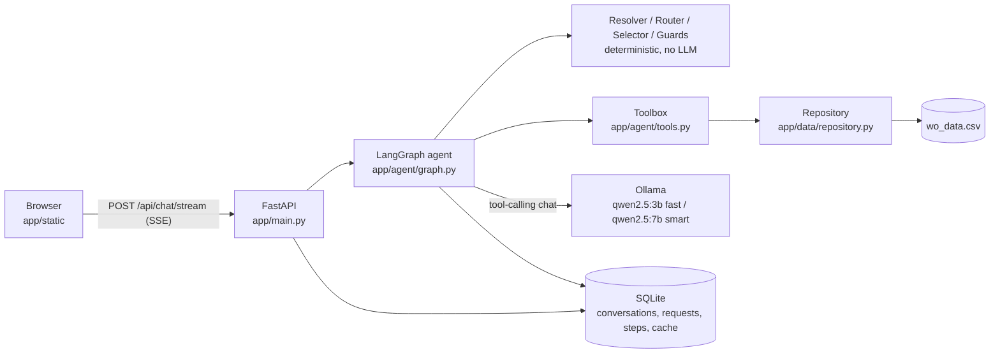
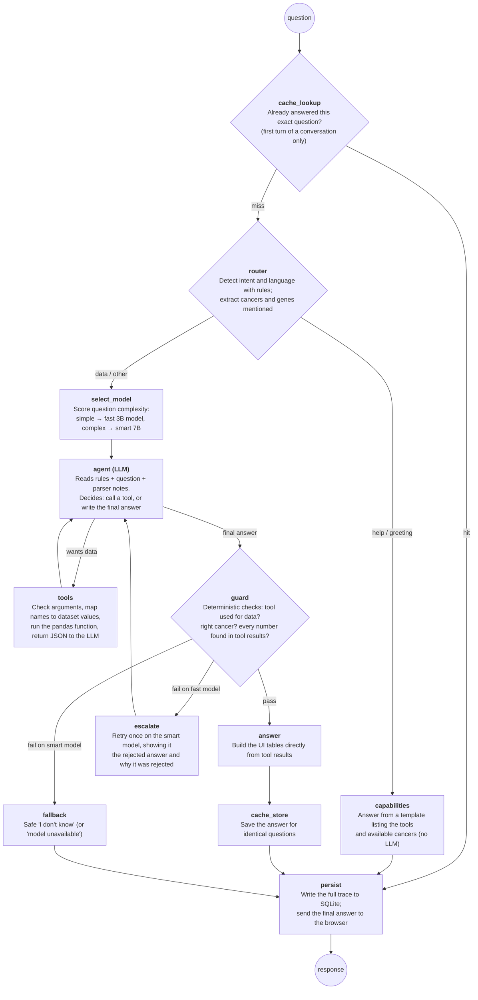

# Architecture

## Components



## Request flow (LangGraph)

Each box is a graph node, and diamonds are decision points. One question travels from top to bottom. Only the
`agent` node calls an LLM; every other node is plain, deterministic Python.



Every node except `persist` is wrapped by `@traced` (`app/store/tracing.py`). The wrapper measures the node's
latency, streams a `step` event to the UI (the progress chips) and appends a step record. `persist` writes all
of them to SQLite at the end.

The `agent` ⇄ `tools` loop is the ReAct pattern: the LLM reasons, calls a tool, reads the result, and repeats
until it can answer. It is capped at 4 iterations (`MAX_TOOL_ITERATIONS`).

## Component details

There is **one AI component**: the LLM inside the `agent` node. Everything around it is deterministic code that
prepares its input, constrains what it can do, and checks what it says.

### API: `app/main.py`
- **Does:** exposes the chat endpoints. `POST /api/chat/stream` streams Server-Sent Events, `POST /api/chat`
  returns plain JSON. It also exposes history, traces and health, and serves the static UI. Before running the
  graph it creates the conversation and loads its previous turns.
- **At startup:** it builds the dependencies once (data, resolver, tools, selector, LLM factory, store). It also
  runs the **warm-up** in the background: both models are loaded into RAM, and the system prompt is
  pre-processed (see [Prompt layout](#prompt-layout-kv-cache-friendly)).

### Orchestration: `app/agent/graph.py`
- **Does:** the LangGraph state machine above. A shared state object (question, mentions, tier, messages, tool
  results, guard verdict, steps…) flows through the nodes. The edges decide the path: cache hit, help route,
  tool loop, escalation, fallback.
- **Why LangGraph:** the control flow is explicit and matches the diagram one to one, and per-node streaming
  feeds the UI.

### Resolver: `app/agent/resolver.py`
- **Does:** maps free text to dataset values. Handles synonyms in English and French (`kidney` → renal,
  `sein` → breast, `NSCLC` → lung), accents, a "cancer" suffix, and typos (`brest` → breast, by fuzzy
  matching). It also extracts mentions from the question: known cancers, **unknown** cancers such as
  "esophageal", and gene symbols.
- **Used by:** the tools (argument resolution), the router and selector (entity counts), the guards
  (substitution checks) and the parser notes given to the LLM.
- **Key choice:** an unknown name returns "not found", never the closest match. Esophageal is deliberately *not*
  mapped to gastric: an enum of known cancers would push a small model to pick the
  closest one, while free text plus this resolver yields an honest "not in the dataset".

### Router: `app/agent/router.py`
- **Does:** sorts each question with regular expressions into `help`, `greeting`, `data` or `other`, and detects
  English or French.
- **Why rules:** "How can you help me?" is answered in about 10 ms without an LLM. A misroute is harmless,
  because `other` still reaches the agent and the guards still apply.

### Model selector: `app/agent/model_selector.py`
- **Does:** computes a weighted complexity score from cheap features: extra cancers mentioned, genes,
  comparison words, ranking or aggregation words, extra clauses, length, follow-up pronouns. A score of 3.0 or
  more goes to the smart tier (`qwen2.5:7b`), lower to the fast tier (`qwen2.5:3b`).
- **Extensible:** a new feature is one line. The whole selector can be swapped for any object with a
  `select()` method, such as an embedding classifier trained on stored traces.

### Agent LLM: `app/agent/llm.py` + `app/agent/prompts.py` (the only AI)
- **Does:** understands the question, chooses tools and their arguments, and writes 1–3 sentences in the user's
  language.
- **What it receives:**
  - the rules and schema (`SYSTEM_PROMPT`);
  - the tool definitions;
  - the last 3 turns of the conversation;
  - the question, followed by **parser notes** from the resolver ("cancers NOT in the dataset: esophageal").
- **Settings:** temperature 0, a fixed seed, and answers capped at 320 tokens. `PROMPT_VERSION` is stamped in
  every trace and cache key.

### Tools: `app/agent/tools.py`
- **Does:** the registry of the 6 functions the LLM may call: `list_cancer_types`, `get_targets`,
  `get_expressions`, `summarize_expressions`, `find_cancers_for_gene` and `top_genes`. For each call it:
  - validates the arguments with Pydantic, leniently ("TP53, KRAS" becomes a list);
  - resolves names through the resolver;
  - returns JSON.
- **Errors are data:** `unknown_cancer` (with the available list), `wrong_tool` (with a hint), or
  `invalid_arguments`. The LLM reads them and can explain or correct itself.
- **Also:** `to_table()` turns tool results into the tables the UI displays.
- **Security:** nothing else can be executed. There is no SQL and no code evaluation.

### Data: `app/data/repository.py` and `app/data/primitives_original.py`
- **Does:** the only place that reads the CSV. It holds the primitives, including the **fixed, cancer-scoped
  `get_expressions`**, plus summary statistics, a reverse lookup and rankings.
- **Catalog:** at startup it builds the catalog (cancers, genes, row count, data hash). That is the schema
  cache used in prompts, the help answer and cache keys.
- **Original code:** `primitives_original.py` keeps the provided functions verbatim, with their bug documented
  and covered by a test.

### Guards: `app/agent/guards.py`
- **Does:** checks the final answer in about 0.1 ms, with no LLM. A data question must have used a tool. The
  model must not have queried a cancer the user never mentioned. A cancer absent from the dataset must not be
  answered with values. Every decimal in the answer must exist in the tool results, up to rounding.
- **On failure:** the fast tier escalates once to the smart tier with a plain-language critique
  (`prompts.CRITIQUE`). The smart tier falls back to "I don't know".

### Persistence and observability: `app/store/`
- `db.py` + **[`schema.sql`](../app/store/schema.sql)**: SQLite conversations, request traces, per-node steps and
  the cache.
- `cache.py`: the exact-match cache key. It is never semantic, because "breast" and "esophageal" questions look
  alike to an embedding but need opposite answers.
- `tracing.py`: the `@traced` decorator (latency, SSE step events, step records).

### UI: `app/static/`
- **Does:** plain HTML/CSS/JS, with no build step. It has a conversation sidebar, a centered composer, live
  progress chips, streamed text, tables with expression bars, and a trace drawer and activity view built on
  the history API.

### Evaluation: `eval/`
- **Does:** `questions.yml` holds 16 golden cases with behavioural expectations (tools called, exact table
  values, forbidden content). `run_eval.py` runs them against the real models and reports the pass rate,
  tier usage, escalation rate and latency percentiles.

## Prompt layout (KV-cache friendly)

### The problem

Before an LLM writes its first word, it must read the whole prompt. For every prompt token it computes
attention "keys and values", stored in the **KV cache**. On a laptop CPU this runs at about 20–30 tokens per
second. Our prompt is about 1,000 tokens (rules, data schema, and the JSON definitions of the 6 tools), so
reading it from scratch takes 30–60 s on every question.

### The mechanism we rely on

Ollama (llama.cpp) keeps the KV cache of the previous request in memory. When a new prompt arrives, it compares
the two token by token and **reuses the cache up to the first difference**: only the tokens after that point
are processed again. The Ollama logs show it as `lcp` (longest common prefix).

### The layout

Everything that is identical for every question goes first. Everything that varies goes last.

```
[system]  rules + data schema + tool JSON schemas    ← identical for every request: reused from the cache
[user]    previous question (if any)                 ← last 3 turns of this conversation
[ai]      previous answer
[user]    question + "(Parser notes: cancers in dataset: …; NOT in dataset: …; genes: …; answer in French)"
[ai/tool] tool calls / tool results …                ← grows during the agent ⇄ tools loop
```

The qwen2.5 chat template renders the tool definitions inside the system block. Keeping the system message
byte-identical therefore keeps the whole ~1,000-token prefix reusable.

### How it is used in the code

- `prompts.system_prompt()` depends only on the dataset catalog, never on the request. There is no language,
  question or date in it.
- `prompts.hint()` holds everything request-specific: parser notes, answer language, and the "call a tool first"
  reminder. `graph._initial_messages()` appends it to the **last user message**.
- `main.warmup()` sends that system prompt to both models at startup. The cache is already filled when the
  first real question arrives.
- Inside one request, the second LLM call (after a tool result) shares the entire first prompt, so only the
  tool result is new.

### Measured effect

The first version put the parser notes inside the system prompt. The prompts then diverged after about 330
tokens, so the tool definitions were re-read on every question. The first LLM call took **65 s**. After moving
the notes to the user turn, it takes **about 3 s**.

### Limits

- Each model has its own cache. An escalation to the smart model pays for its own prefix, which is why the
  warm-up primes both.
- Any edit to the system prompt or a tool definition invalidates the prefix once, until it is cached again.
- With one Ollama slot (`OLLAMA_NUM_PARALLEL=1`), concurrent users share the cached system prefix but not their
  conversation history.

## Performance on CPU

Measured on the development laptop (i5-1245U, Docker, CPU only). The first live run took about 90 s per
question. These changes brought it to about 15 s end to end, with progress visible within a second:

| Change | Effect |
|---|---|
| [Prompt layout](#prompt-layout-kv-cache-friendly): an identical system prompt across requests, with per-question notes at the end | First LLM call **65 s → 3 s** |
| Warm-up at startup: both models loaded, prompt cache pre-filled | The first question costs no model load |
| `LLM_NUM_THREAD` setting. On hybrid CPUs, Ollama may pick only the 2 P-cores | Generation 5 → 10 tokens/s |
| Answers capped at 320 tokens and ≤3 sentences, because the UI already shows the tables | Shorter generation |
| Tool outputs compact, sorted and pre-digested (highest and lowest stated) | Fewer prompt tokens, fewer misreadings |
| Deterministic route for help and greetings | "How can you help me?" in about 10 ms |
| SSE streaming of step chips, then tokens | The user sees progress immediately |

A Mac with native Ollama (GPU via Metal) or any GPU machine is several times faster.

## Data model (SQLite, `var/oncochat.db`)

The full schema, with a comment on every column, is in **[`app/store/schema.sql`](../app/store/schema.sql)**. The
app applies it at startup, and it is idempotent.

| Table | One row per | Used for |
|---|---|---|
| `conversations` | chat thread | sidebar list and titles |
| `requests` | question asked | answer, status, tier and model, escalation, cache hit, guard verdict, tool calls, tables, latency, tokens, data and prompt versions |
| `steps` | graph node executed | step-by-step timeline in "View trace", latency per node |
| `cache` | cached answer | exact-match cache with TTL and hit counter; a trigger purges expired rows on each insert |

Useful queries for later evaluation:

```sql
-- escalation and fallback rate per prompt version
SELECT prompt_version, AVG(escalated), AVG(status='fallback'), AVG(latency_ms) FROM requests GROUP BY 1;
-- which guard reasons fire most
SELECT json_extract(guard_json,'$.reasons'), COUNT(*) FROM requests WHERE status!='ok' GROUP BY 1;
-- slowest nodes
SELECT node, AVG(latency_ms), MAX(latency_ms) FROM steps GROUP BY node ORDER BY 2 DESC;
```

## API

| Method | Path | Purpose |
|---|---|---|
| POST | `/api/chat/stream` | SSE: `start`, `step`*, `token`*, `reset`?, `final` (or `error`) |
| POST | `/api/chat` | Same pipeline, single JSON response |
| GET | `/api/conversations`, `/api/conversations/{id}` | Sidebar and conversation replay |
| GET | `/api/history?limit=&status=` | Aggregate stats and recent requests |
| GET | `/api/traces/{request_id}` | Full trace with per-node steps |
| DELETE | `/api/cache` | Clear the answer cache |
| GET | `/api/health` | Ollama reachability, models pulled, warm-up state, versions |
| GET | `/docs` | OpenAPI UI |
